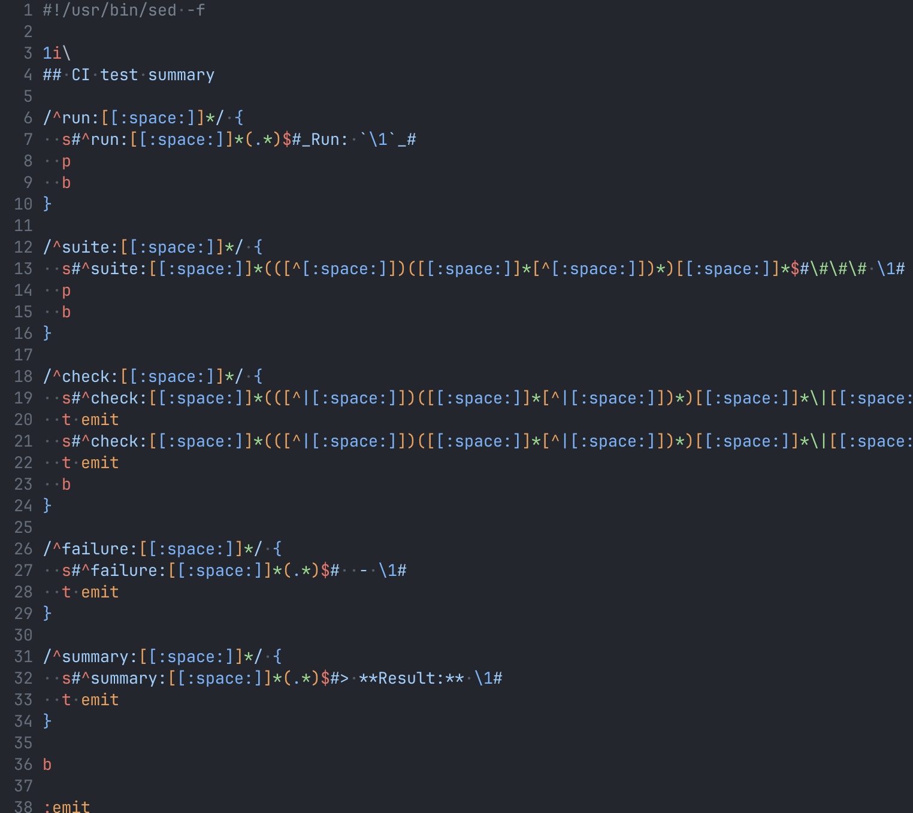

# tree-sitter-posix-sed

[Tree-sitter](https://tree-sitter.github.io/tree-sitter/) grammars for
POSIX.1-2024 `sed` syntax.

## Languages

Choose the language that matches the regular expression mode.

| Regex mode | Language |
| --- | --- |
| BRE | `posix_sed_bre` |
| ERE | `posix_sed_ere` |

## Usage

### Emacs

For example, POSIX BRE uses `posix_sed_bre` from `posix-sed-bre/src`:

```elisp
(add-to-list
 'treesit-language-source-alist
 '(posix_sed_bre
   . ("https://github.com/konomanoasa/tree-sitter-posix-sed"
      nil
      "posix-sed-bre/src")))

(treesit-install-language-grammar 'posix_sed_bre)
```

Emacs does not include a Tree-sitter major mode for `sed`; define a custom
major mode that uses the parser.



_An example of POSIX ERE `sed` syntax highlighting in Emacs._

### Language server

[sed-language-server](https://github.com/konomanoasa/sed-language-server) uses
these grammars to provide diagnostics, formatting, and label navigation
through the Language Server Protocol.

## Specifications

- [POSIX.1-2024 `sed`](https://pubs.opengroup.org/onlinepubs/9799919799.2024edition/utilities/sed.html)
- [POSIX.1-2024 regular expressions](https://pubs.opengroup.org/onlinepubs/9799919799.2024edition/basedefs/V1_chap09.html)

## License

[MIT](LICENSE)
